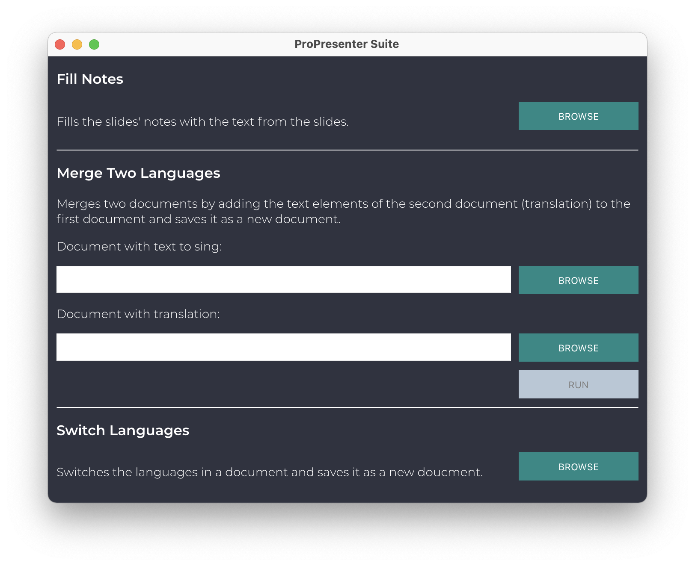

# ProPresenter Suite

## Introduction

As a church in Germany we sing a lot of songs in English and want to display German translations as well. For our international community we want to display English translations for the German songs. Sometimes we want to switch the language. And on the stage display we'd rather only show the lyrics without the translations.

Accomplishing this in ProPresenter can be quite cumbersome so this little suite offers the following functions to manipulate ProPresenter 7 (.pro) and ProPresenter 6 (.pro6) files:
* Fill notes: copies the text of the top layer text fields of each slide to the slide's notes (to display the slide notes on the stage display)
* Merge two languages: copies the top layer text fields of each slide of one presentation into another and saves it as a new presentation
* Switch languages: switches the two top layer text fields of each slide of one presentation and saves it as a new presentation

## Installation

Installers for Windows and macOS are available under [releases](https://github.com/jonathanschneider/ProPresenter-Suite/releases).

## Usage

1. Start ProPresenter Suite.
1. In the section of the function you want to execute, browse the file you want to edit. ProPresenter Suite will show a notification once it finishes.
1. In ProPresenter force save by pressing Ctrl + S or Cmd + S.
1. Choose "Revert" in the dialog.

## Contribution

If you want to contribute, here are some hints to get you started:

This app is built on [Electron](https://www.electronjs.org) and thus requires [Node.js](https://nodejs.org).

Clone repository and install dependencies:

    git clone https://github.com/jonathanschneider/ProPresenter-Suite.git
    cd ProPresenter-Suite
    npm install --production=false

Start the app from the CLI:

    npm start

Package app and create installers:
* Windows:

      npm run package-win
      npm run create-installer-win

* Mac:

      npm run package-mac
      npm run create-installer-mac

## Credits

greyshirtguy for his [proto](https://github.com/greyshirtguy/ProPresenter7-Proto) files to decode ProPresenter 7 files
